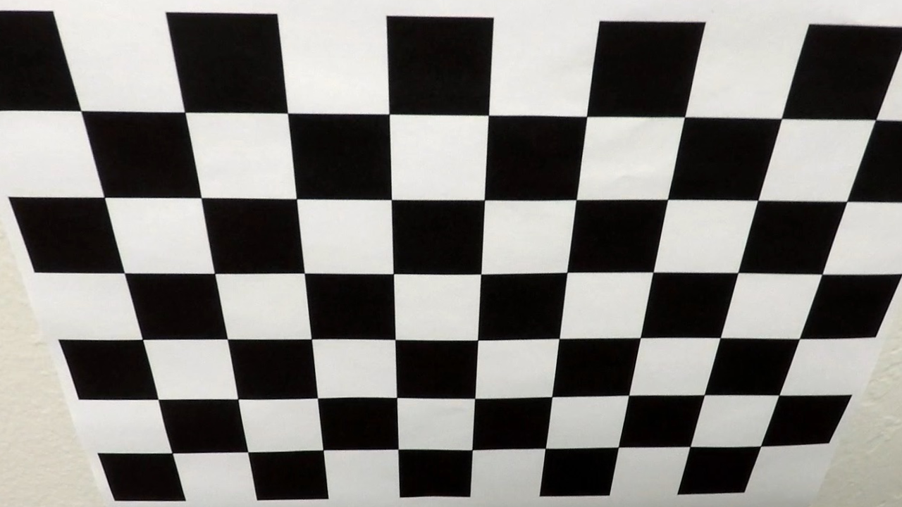
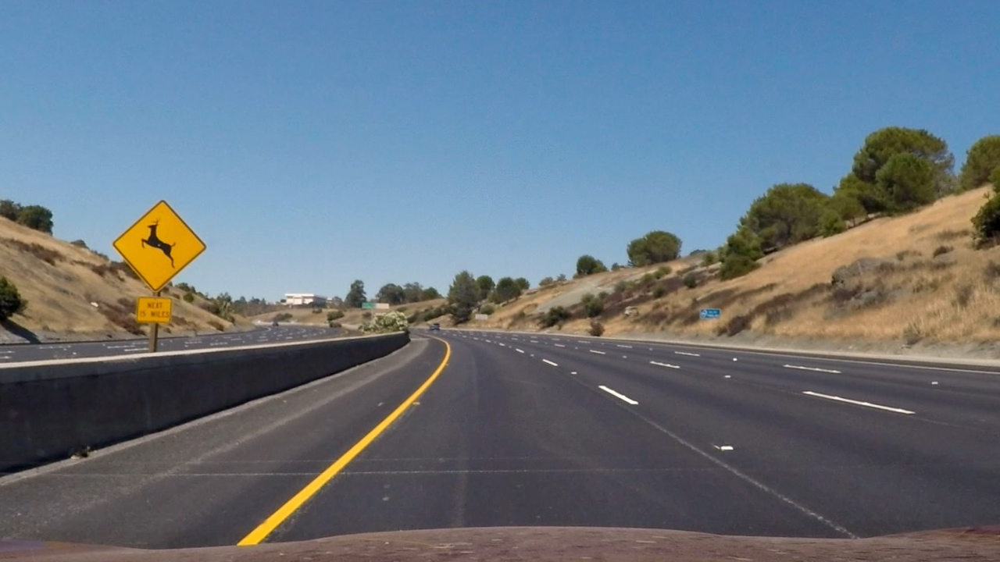
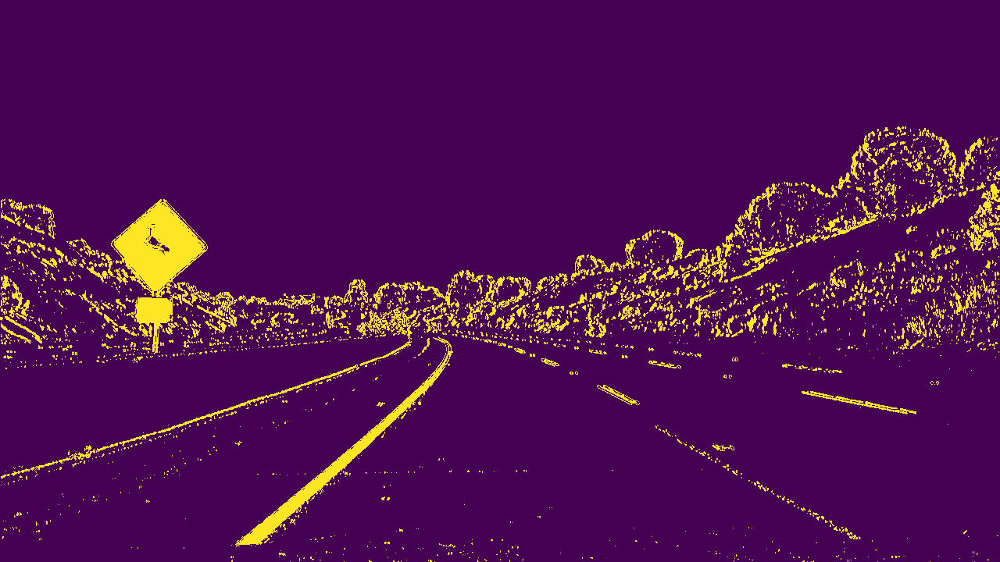
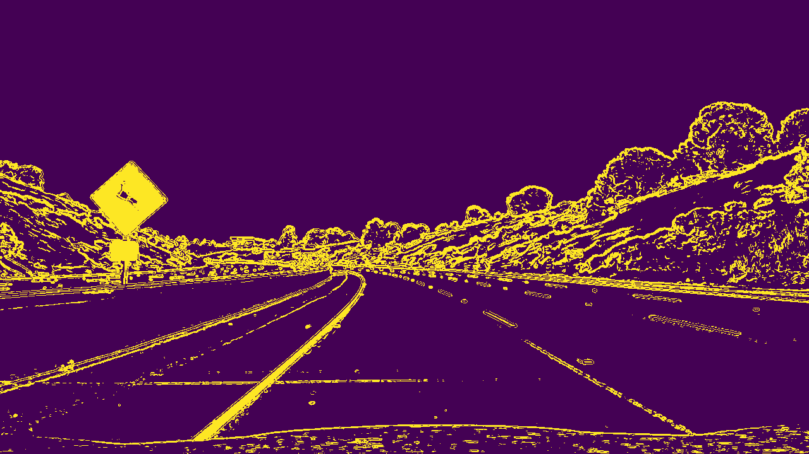
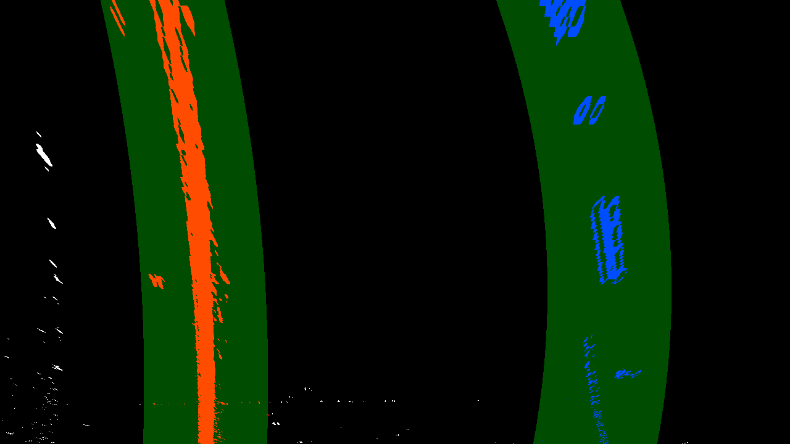
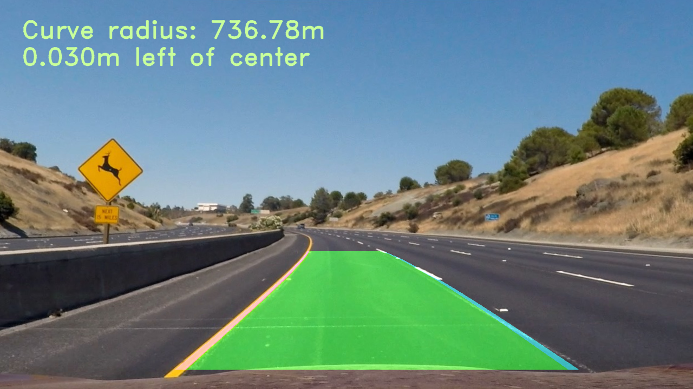

## Writeup for Advanced Lane Line Project

---

**Advanced Lane Finding Project**

The goals / steps of this project are the following:

* 1. Compute the camera calibration matrix and distortion coefficients given a set of chessboard images.
* 2. Apply a distortion correction to raw images.
* 3. Use color transforms, gradients, etc., to create a thresholded binary image.
* 4. Apply a perspective transform to rectify binary image ("birds-eye view").
* 5. Detect lane pixels and fit to find the lane boundary.
* 6. Determine the curvature of the lane and vehicle position with respect to center.
* 7. Warp the detected lane boundaries back onto the original image.
* 8. Output visual display of the lane boundaries and numerical estimation of lane curvature and vehicle position.

### Here I will consider the rubric points individually and describe how I addressed each point in my implementation.  

---

### Writeup / README

#### I flow the instruction that listed in the header of this file. these instructions are also the cube to implements the final goals (dynamic find the Lane in the video). The major steps are: 
1. get the global camera matrix and distortion coeffcients; 
2. use them to undistort the images;
3. using color(HLS), gradients threshold to transform them to get a binary image;
4. after that, implement the "birds-eye view" perspective transform;
5. and then, find the lane boundary by the histogram and the polynomial method;
6. follow that, compute the curvature and the vehicle position estimation;
7. and then, build a pipeline to implement a raw image to detect the lane boundary and the curvature computing;
8. finally based on thie pipeline, dynamic convert the videos;

### Camera Calibration

#### 1. from the given chessboards to get the global camera matrix and distortion coefficients. The implement codes are the step 1 cell that embeded in the P2.ipynb.
 the major steps are:
##### 1). prepare "object points", which will be the (x, y, z) coordinates in real world space. and then 
##### 2). call cv2.findChessboardCorners(..,(nx,ny),..) to get the corners for "imgpoints`", where the (nx,ny) are (nx=9, ny=6) for the givend chessboards;
##### 3). compute all the given chessboards to append to the list-- "objpoints" and "imgpoints";
##### 4). and then you can cv2.calibrateCamera() to get the matrix and distortion coefficients;

here is a example images that undistorted:

<table><tr>
<td></td>
<td></td>
</tr></table>

### Pipeline (single images)

#### 1. undistort a raw images of a distortion-corrected image.
	This step is using cv2.undistort() to get the undistorted image by using the above camera matrix (mtx) and distortion coefficients(dist). apply this to get one example picture as below:

<table><tr>
<td></td>
<td></td>
</tr></table>

#### 2. Use color transforms, gradients, etc., to create a thresholded binary image. 
The implement codes are the step 3 cell that embeded in the P2.ipynb. The major steps are:  
##### 1). using the gradient sobels(cv2.Sobel()) square root and the threshold is sx_thresh(20,100); 
##### 2). the color transforms, get the HLS s chanel and threshold is s_thresh=(170, 255); 
##### 3). after that, combine the gradient and color threshold get the binary.

also, there is a example for input undistorted image and result binary via this step
<table><tr>
<td></td>
<td></td>
</tr></table>

#### 3. Apply a perspective transform to rectify binary image ("birds-eye view").
The implement codes are the step 4 cell that embeded in the P2.ipynb. The major steps are:  
##### 1). define the region of source and destination points as src,dst array np.float32(...).
	src = np.float32([(575,465),
					  (720,465), 
					  (290,685), 
					  (1090,685)])

	dst = np.float32([(400,0),
					  (width-400,0),
					  (400,height),
					  (width-400,height)])

##### 2). call the cv2.getPerspectiveTransform(src,dst) get M and with ..(dst,src) to MinV;
##### 3). call cv2.warpPerspective() to get the wrap image

also, there is a example for input image and perspectived binary via this step
<table><tr>
<td></td>
<td></td>
</tr></table>

#### 4. Detect lane pixels and fit to find the lane boundary.
The implement codes are the step 5 cell that embeded in the P2.ipynb. The major steps are:  
##### 1). call histogram(np.sum(..) in x axis) for one window;
##### 2). and then slide to find the lane;
##### 3). also get get the left and right lane's indics, leftx,lefty,rightx,righty,..
##### 4). to get polynomial(y=Ax**2+Bx**2+C) 

and, there is a example for input image and fitpolyed binary via this step
<table><tr>
<td></td>
<td></td>
</tr></table>

#### 5. Determine the curvature of the lane and vehicle position with respect to center.
The implement codes are the step 6 cell that embeded in the P2.ipynb. The major steps are:  

##### 1). first change pixels to meters in real road, by ym_per_pix = 30/720 and xm_per_pix = 3.7/700
##### 2). and then calculate the radius of curvature:
    left_curverad = ((1 + (2*left_fit_cr[0]*y_eval*ym_per_pix + left_fit_cr[1])**2)**1.5) / np.absolute(2*left_fit_cr[0])
    right_curverad = ((1 + (2*right_fit_cr[0]*y_eval*ym_per_pix + right_fit_cr[1])**2)**1.5) / np.absolute(2*right_fit_cr[0])

##### 3). also get the center position and the distance:
    lane_center_position = (right_fit_x_int + left_fit_x_int) /2
    center_dist = (car_position - lane_center_position) * xm_per_pix

and, there is a example for input undistorted image and result binary via this step

left,right_curv:33532.599413 m,489.279429 m,distance:-0.058217 m

#### 6. Output visual display of the lane boundaries and numerical estimation of lane curvature and vehicle position.
The implement codes are the step 7,8 cells that embeded in the P2.ipynb. The major steps are:  

##### 1). call np.polyfit() to get the leftx and rightx for the left lane and right lane;
##### 2). call cv2.polylines() to Draw the lane onto the warped blank image;
##### 3). call cv2.addWeighted() to Combine the result with the original image;
##### 4). call cv2.putText() to plot the data for curv_rad and center_dist

and, there is a example for input image and result image via this step

<table><tr>
<td></td>
<td></td>
</tr></table>

#### 7. finally build a pipeline for a original image to img_with_data according to the steps above.

The implement codes are the step 9 cells that embeded in the P2.ipynb. The major steps are includes the steps above:
##### 1). get the global variables, mtx and dist from the camera calibration ;
##### 2). call cv2.undistort() to get the undistorted image;
##### 3). call transformByColorGradients() to get the transformed images via threshold color, gradients image;
##### 4). call unwarpToPerspective() to get the unwarped image;
##### 5). call findLanePixels() to get left and right lane inds;
##### 6). after that, plot the lane and data to get the final image

And add a Line() and Pipeline() class to store the fit_ok frame and skip the fit failure frame for the continure video.

finally, the test images are outputed on the directory ./output_images.

---

### Pipeline (video)

#### 1. to use the process_image() to warp the pipeline and call the video file clip to write the output file into  dir ./output_videos/.

Here's a [link to my video result](./output_videos/P2_video_output.mp4)

---

### Discussion

#### Based on the first try to submit, according to the suggestion, have the following major changes:
##### 1). change the birds' eye (src, dst);
##### 2). change the pixels to the meter according to the real pixels means value provided in the  function fitPoly() and appy for the function laneSanityCheck()
##### 3). add class Line() and Pipeline() class to store the fit ok frame and skip the fit failure frame.
