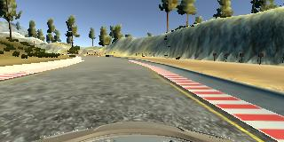
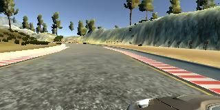
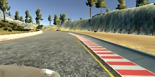

# **Behavioral Cloning** 


### The purpose of this project is using the udacity's simulator to get the training,validation images and other data set, such as the steering angle, and then using the model in keras to train the model. After output of the model.h5, use the model.h5 in the simulator to drive the car in autonomous mode without leaving the road.

---

**Behavioral Cloning Project**

The goals / steps of this project are the following:
* step 1: Use the simulator to collect data of good driving behavior (go to the GPU mode in workspace and run the simulator)
* step 2: Build, a convolution neural network in Keras that predicts steering angles from images (model.py)
* step 3: Train and validate the model with a training and validation set (python model.py )
* step 4: Test that the model successfully drives around track one without leaving the road (python drive.py model.h5 run2 and then python video.py run2)


## Rubric Points
### Here I considered the [rubric points](https://review.udacity.com/#!/rubrics/432/view) individually and describe how I addressed each point in my implementation.  

---
### Files Submitted & Code Quality

#### 1. Submission includes all required files and can be used to run the simulator in autonomous mode

My project includes the following files:
* model.py containing the script to create and train the model
* drive.py for driving the car in autonomous mode(no changes, provided by the project workspace.)
* model.h5 containing a trained convolution neural network 
* video.mp4 a video recording of vehicle driving autonomously for one lap around the track
* writeup_p4.md summarizing the results(this file)

#### 2. Submission includes functional code
Using the Udacity provided simulator and drive.py file, the car can be driven autonomously around the track by executing 
```sh
python drive.py model.h5 run2
```

#### 3. Submission code is usable and readable

The model.py file contains the code for training and saving the convolution neural network. The file shows the pipeline I used for training and validating the model, and it contains comments to explain how the code works.

### Model Architecture and Training Strategy

#### 1. An appropriate model architecture has been employed

My model acquired the NVIDIA's convolution neural network, the reference articles [NVIDIA Drive Model](https://devblogs.nvidia.com/deep-learning-self-driving-cars/) 

The data is normalized in the model using a Keras Lambda layer (code in function nvidia_network()). 

#### 2. Attempts to reduce overfitting in the model

The model contains dropout layers, the rate is 0.3, in order to reduce overfitting (code in function nvidia_network()). 

The model was trained and validated on different data sets to ensure that the model was not overfitting. And the model was tested by running it through the simulator and ensuring that the vehicle could stay on the track.

#### 3. Model parameter tuning

The model used an adam optimizer, so the learning rate was not tuned manually (code in function nvidia_network()).

#### 4. Appropriate training data

Training data was chosen to keep the vehicle driving on the road. I used a combination of center lane driving, recovering from the left and right sides of the road with a correction around +/-0.15. 


### Model Architecture and Training Strategy

#### 1. Solution Design Approach

The overall strategy for deriving a model architecture was to ensure the car stay in the ceter of the lane.

The project instruction has a very detail actions, so I read it very carefully and understand it is not easy to use the normal network and also it mentioned that the NVidia Network. 

So I try to find the NVIDIA model prototype and understand it.


Then I try to have a whole process, recording some pictures, training, and autonomously drive. after that I do some fine tuning. such as: data-preprocess, combat the overfitting, parameters try.


At the end of the process, the vehicle is able to drive autonomously around the track without leaving the road.

#### 2. Final Model Architecture

The final model architecture (nvidia_network()) consisted of a convolution neural network with the following layers

	# pre-process the data...
	model.add(Lambda(lambda x: x/255.0 - 0.5, input_shape = (160, 320, 3)))
	model.add(Cropping2D(cropping = ((50,20),(0,0))))
	#
	model.add(Convolution2D(24, 5, 5, subsample = (2,2), activation = "relu"))
	#
	model.add(Convolution2D(36, 5, 5, subsample = (2,2), activation = "relu"))
	#
	model.add(Convolution2D(48, 5, 5, subsample = (2,2), activation = "relu"))
	#
	model.add(Convolution2D(64, 3, 3, activation = "relu"))
	#
	model.add(Convolution2D(64, 3, 3, activation = "relu"))
	#
	model.add(Flatten())
	#
	model.add(Dropout(0.3))	
	#
	model.add(Dense(100))
	#
	model.add(Dropout(0.3))
	#
	model.add(Dense(10))
	# Get the steering angle.
	model.add(Dense(1))


#### 3. Creation of the Training Set & Training Process

To capture good driving behavior, as the project instruction, the car should stay in the center of the road as much as possible. For example as below:

<table><tr>
<td></td>
<td></td>
</tr></table>


Also, recorded the vehicle recovering from the left side and right sides of the road back to center, this idea is also provided by the project instruction. I adopted and the steering angele correction for left side is +1.5 and right side is -1.5.


<table><tr>
<td></td>
<td></td>
<td></td>
</tr></table>


And then augment the data set, using flipped images and angles to get double data set.


After that, I finally randomly shuffled the data set and put 30% of the data into a validation set. 

I used this training data for training the model. 
The validation set helped determine if the model was over or under fitting. 
I used an adam optimizer so that manually training the learning rate wasn't necessary. The ideal number of epochs was 3 as evidenced by trying some epochs. Here are the output of the training epoches:

*Epoch 12/3
*4579/4579 [==============================] - 1772s - loss: 0.0109 - val_loss: 0.0114
*Epoch 2/3
*4579/4579 [==============================] - 1774s - loss: 0.0040 - val_loss: 0.0109
*Epoch 3/3
*4579/4579 [==============================] - 1784s - loss: 0.0027 - val_loss: 0.0095


