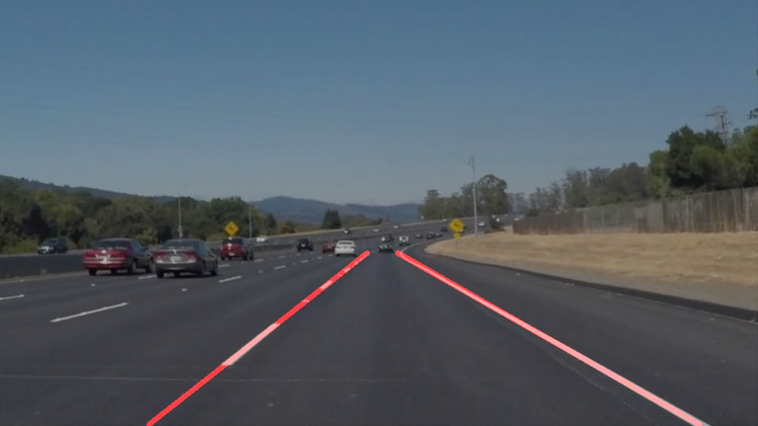
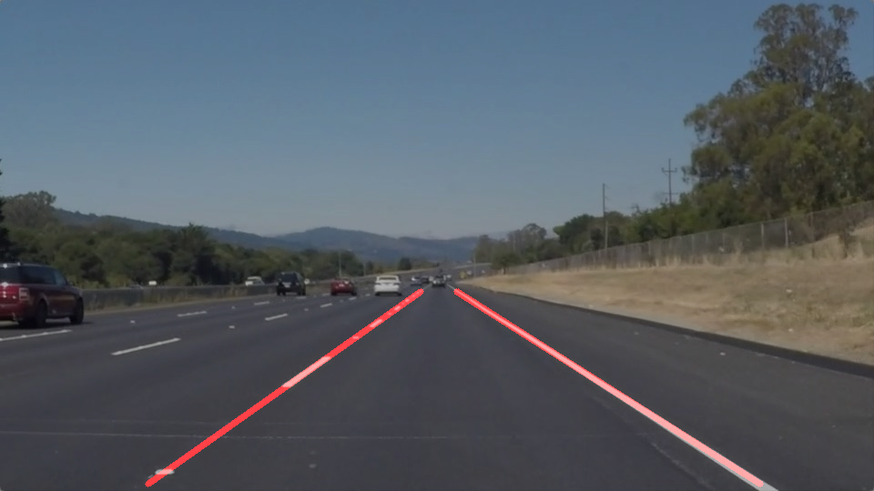
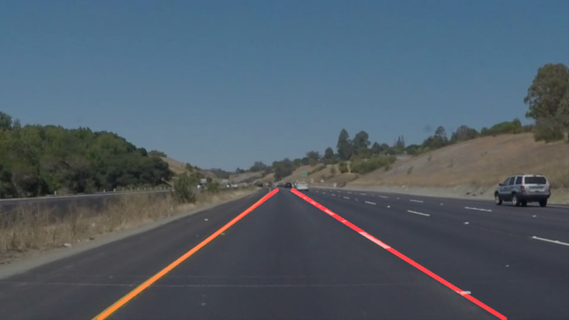
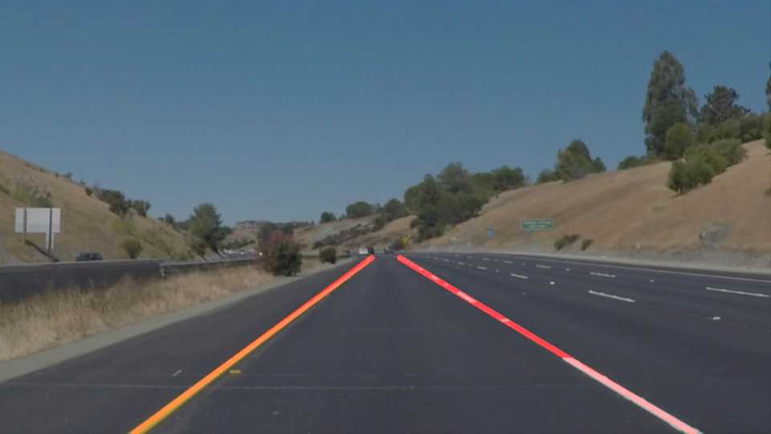
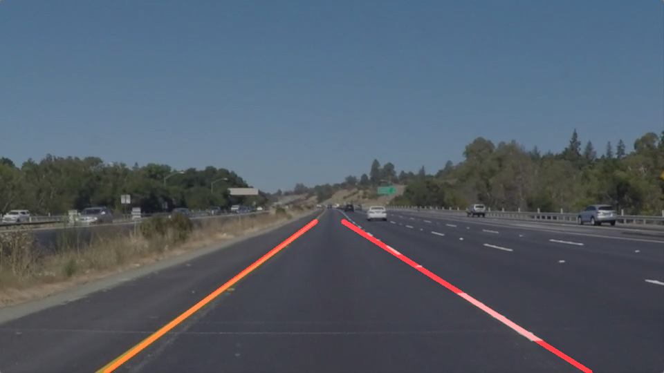
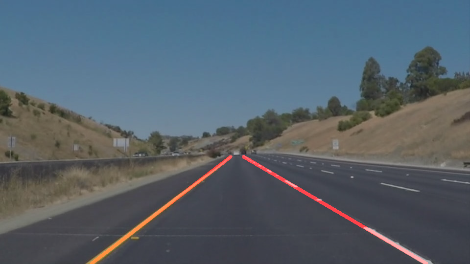

# **Finding Lane Lines on the Road** 

## Writeup Report
### This is the first writeup for finding the lane lines on the road after studying that gray a picture, set a region of interesting, canny poly and Hough transform to get the liens.

---

**Finding Lane Lines on the Road**

The goals / steps of this project are the following:
* Make a pipeline that finds lane lines on the road
* Reflect on your work in a written report

examples source image(left)and output of the pipeline(right)

<table><tr>
<td></td>
<td></td>
</tr>
</table>

---

### Reflection

### 1. Describe your pipeline. As part of the description, explain how you modified the draw_lines() function.

My pipeline consisted of 6 steps as below:

* step 1: Read in an image and grayscale the image;
* step 2: Define and apply Gaussian smoothing by gaussian_blur and find the edges by Canny;
* step 3: Define a 4-sides poly (region_of_interest) and get the masked edges (lines);
* step 4: Output the image applying hough_lines on the masked edges;
* step 5: Weighted the img;
* step 6: read all source images and output the expected house lines over the original images.

I got a stuck on improvements of drawing a single line on the left and right lanes, and:
  1. try to use the slope of lines to find the max and min Y, but failed;
  2. ask the tutor for help...
  3. get the right expectation
  to get the following actions:
  1. use the slope to get the left line (<0) and right line(>0);
  2. save the points for left_line and right line;
  3. save the topest Y(min) and bottomest Y(max);
  4. get the slope(k) and b accordign to the math formula y=ax+b by numpy polyfit():
  5. get the maxY and minY between the y=ax+b and then draw the left line and righ line.
  

finally pipeline works, here is the output images from pipeline: 

[Here are the outputs of test images]
<table>
<tr>
<td></td>
<td></td>
<td></td>
</tr>
<tr>
<td></td>
<td></td>
<td></td>
</tr>
</table>

### 2. Identify potential shortcomings with your current pipeline

when the line of road has a big curv, the pipeline looks work bad.

### 3. Suggest possible improvements to your pipeline

A possible improvement would be to draw the multiple lines to meet the curve angles.
