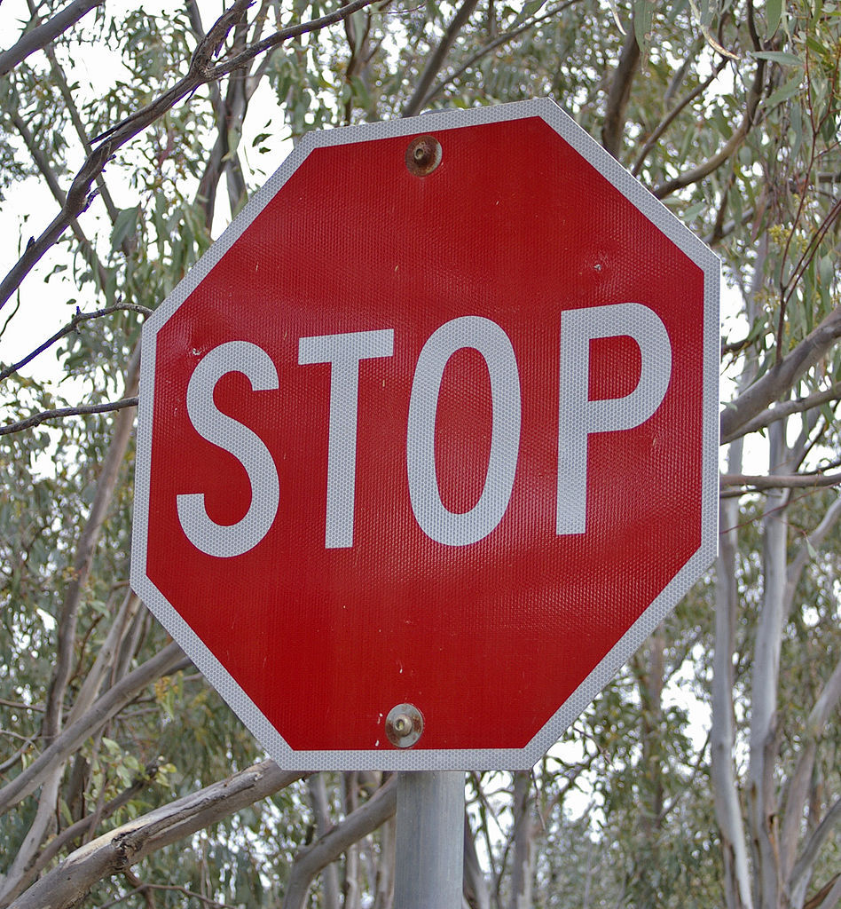

# **Traffic Sign Recognition** 

## Writeup

### This project use the neural network to train/validate/test the traffic sign to implement the traffic sign classifier.

---

**Build a Traffic Sign Recognition Project**

The goals / steps of this project are the following:
* Load the data set (see below for links to the project data set)
* Explore, summarize and visualize the data set
* Design, train and test a model architecture
* Use the model to make predictions on new images
* Analyze the softmax probabilities of the new images

---

### Load the Data Set
#### Using the pickle to read the file to get the basic dataset as below: 
X_train, y_train, X_valid, y_valid, X_test, y_test to
* The size of training set is 34799, 32, 32, 3

### Explore, summarize and visualize the data set

#### 1. Basic information. 
Using numpy's function, get the basic information

* The size of training set is 34799
* The size of test set is 12630
* The shape of a traffic sign image is (32, 32, 3)
* The number of unique classes/labels in the data set is 43

#### 2. Visualization of the dataset.

Using the matplotlib to plot the all classes/labels(43)images, and using histogram to show all numbers of each labels.

here is an example of the labels imag and the histogram:

<table><tr>
<td></td>
<td></td>
</tr></table>

### Design and Test a Model Architecture

#### Preprocess the image data

Before preprocess the image, I had a trial to train and validate the model architecture, but get the low accuracy. So consider preprocess the original data.

First, convert the images to grayscale because Usually the information contained in the grey scale image is enough for classification. And has the following example:

<table><tr>
<td></td>
<td></td>
</tr></table>

And then normalized the image data to standardize the inputs for making training faster and reduce the chances of getting stuck. The mean value of train set after normalized is around -0.354081335648.

#### 2. LeNet() Architecture

The LeNet architecture looks like including model type, layers, layer sizes, connectivity, etc. The model diagram show as below:

Finally, the model consisted of the following layers:

(Note: the key output parameters are: W_out =[ (W−F+2P)/S] + 1, H_out = [(H-F+2P)/S] + 1, D_out = K, where W - Width, F- Filter size, K - Filter number, P - Padding.)
    

| Layer         		      |     Description	        				                 	| 
|:---------------------:|:---------------------------------------------:| 
| Input               		| 32x32x3 RGB image to gray 32*32*1  							                   | 
| Layer 1: Convolutions	| from 32x32*1 (input:W*D*C) to 28x28x6          	|
| RELU					|												|
| Layer 2: Subsampling  | strides = [1,2,2,1],  from 28x28 to 14x14x6 				|
| Layer 3: Convolution  | strides = [1,1,1,1],  from 14x14 to 10x10x16  		|
| RELU					|												|
| Layer 4: Subsampling  | strides = [1,2,2,1],  from 10x10 to 5x5x16 				|
| Layer : Fully connected | from 5x5*16 to 400 				|
| Layer 5: Fully connected | from 400 to 120  				|
| RELU					|												|
| Layer 6: Fully connected | Gaussian connections,logits) from 120 to 84  				|
| RELU					|												|
| Output: Fully connected | Gaussian connections,logits) from 84 to 43(traffic sign)			|

#### 3. Fine tuning the model

To have a higher accuracy and the faster training, use the following parmaters fine tuning:
* the batch size: found that the less batch size is better than the large one
* epochs: the bigger one is better than small, but it is not obvisiouly effect when the epochs is more than 300.
* learning rate: try 2 different rate and select the smaller one.

#### 4. Final Model

After several trials, to acheive the at least 0.93 accuracy on the validation data set, try to preprocess the dataset and using the fine tuning, finally get the following results:

* validation set accuracy of around 0.95
* test set accuracy of 0.939 

### Use the model to make predictions on new images

#### 1. Choose five traffic signs found on the web

I found 5 traffic signs image on the web, the sizes are different and rlevant labels vary in 43 classes. Plot them as below:

<table><tr>
<td></td>
<td></td>
<td></td>
<td></td>
<td></td>
</tr></table>

#### 2. predictions on these new traffic signs

Here are the results of the prediction:

| Image			        |     Prediction	        					| 
|:---------------------:|:---------------------------------------------:| 
| right-of-way     		| right-of-way  								| 
| stop     			    | stop  										|
| speed limit(50km/h)	| speed limit(50km/h)							|
| Children crossing	    | right-of-way  				 				|
| speed limit(70km/h)	| speed limit(70km/h)     						|

The model was able to correctly guess 4 of the 5 traffic signs, which gives an accuracy of 80%. 

#### 3. The softmax probabilities for each prediction. 

Using top_k() to get the probabilities of each images. The following pictues show the 5 images' relevant top_K prediction.

<table><tr>
<td></td>
</tr></table>

